# 如何使用我们的[网站](https://portal.shadowsocks.to)

## 快速检索
* [不同版本的區別](#版本區別)
* [注冊與購買](#注冊與購買)
* [登陸賬戶](#登陸賬戶)
* [查看節點信息](#查看節點信息)
* [下載配置文件](#下載配置文件)
* [查看節點二維碼](#查看節點二維碼)

## 版本區別
**入門版 / Starter**：適合偶爾使用，加速國外網站需求不强烈的客戶  
**進階版 / Premium**：適合使用頻率較高，或是有多個設備需要使用，但對綫路不敏感的客戶  
**旗艦版 / Ultimate**：適合對綫路敏感，要求速度保障的客戶  
**商業版 / Enterprise**：提供定制專綫服務，適合需要獨立帶寬，高保障服務的企業用戶  
**IPv6 Only**: 適合本地網絡支持 IPv6 環境的用戶使用  

## 注冊與購買

* 如果沒有本站的賬號，購買過程中將自動創建賬戶。
* 打開 [https://shadowsocks.to/](https://shadowsocks.to/)并點擊 [Order Now](https://portal.shadowsocks.to/link.php?id=5)，即可查看我們的產品列表。  
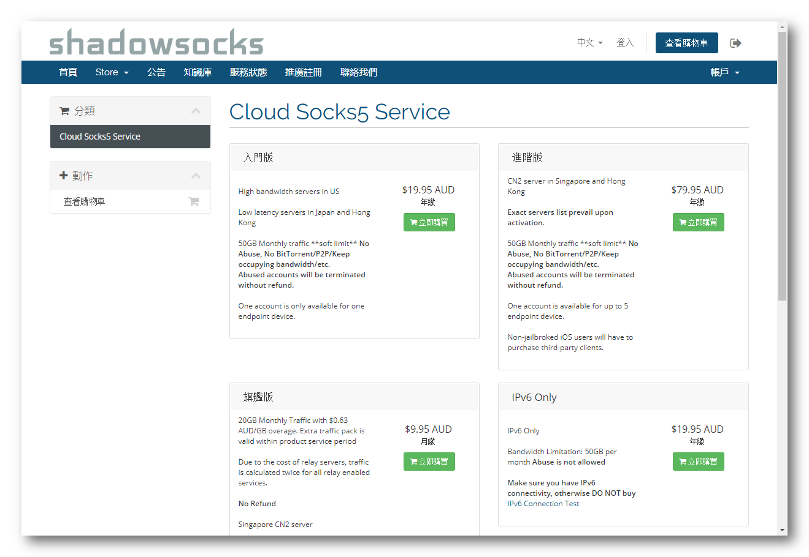

* 選擇想要購買的服務后點擊對應的 **立即購買** ，進入訂單概觀, 我們以旗艦版爲例，選擇付款周期后點擊繼續加入購物車   
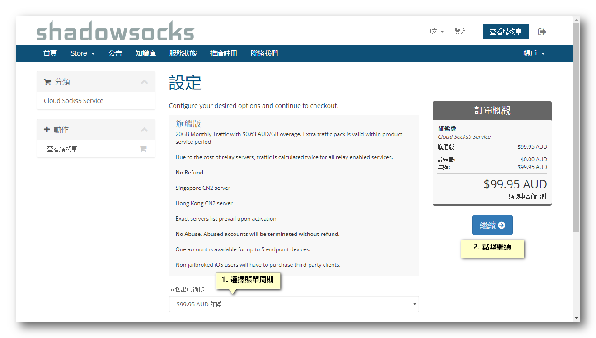  

* 進入結賬界面，點擊 "Checkout"。   
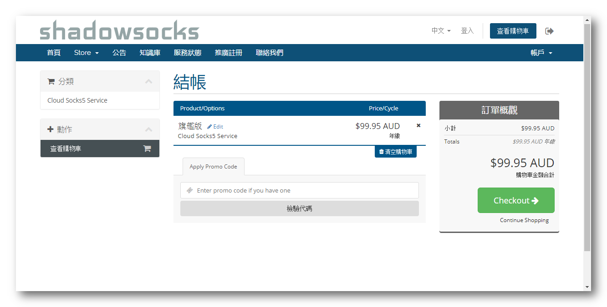

* 填寫完信息后 > 單擊 “完成訂購”，支付賬單。    
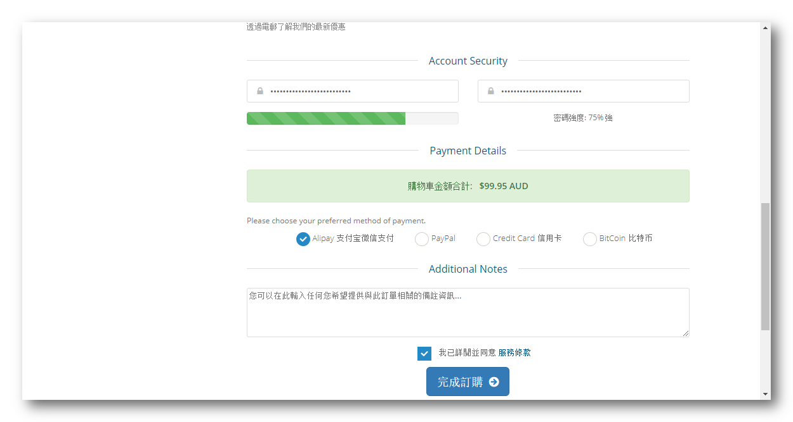  

**閣下可以選擇希望使用的付款方式，我們當前提供的支付方式有**

- Wechat（僅支持中國境内用戶）
- Alipay 支付寶國際版 （僅支持中國境内用戶）
- PayPal （支持全球用戶）
- BitCoin / 比特幣
- 信用卡 / Credit Card  

(我們的結算貨幣為澳元，使用 Wechat/Alipay 可以使用人民幣支付對應賬單)

## 登陸賬戶
#### 登陸 [客戶中心](https://portal.shadowsocks.to),執行下列操作：

* 點擊右上角 “登入”。  
* 填寫 "Email 地址" 和 “密碼” > 點擊 “登入”。  

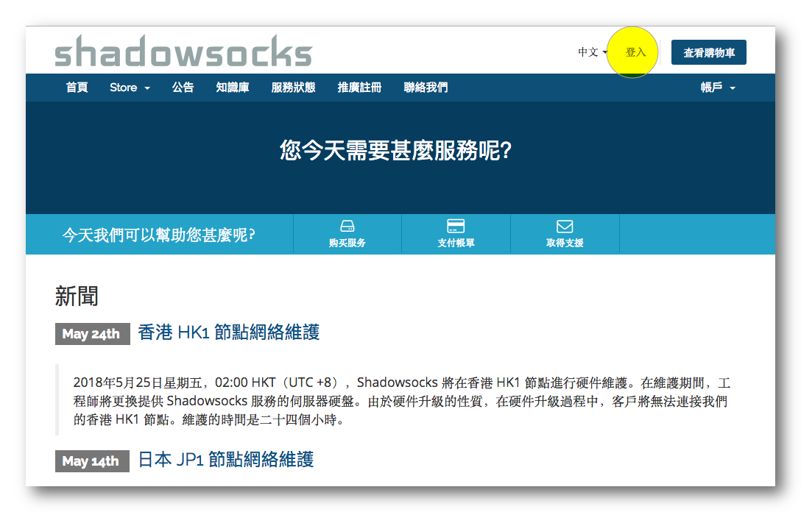  

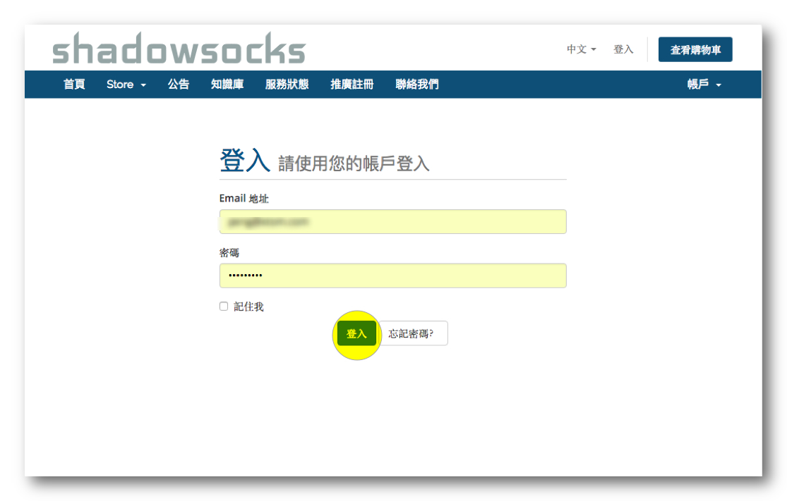

## 查看節點信息
#### 登陸 [客戶中心](https://portal.shadowsocks.to) ,執行下列操作：  

- 單擊 “服務” > "我的服務" > 選擇 "你可用的產品/服務"。
- 查看你的節點信息。

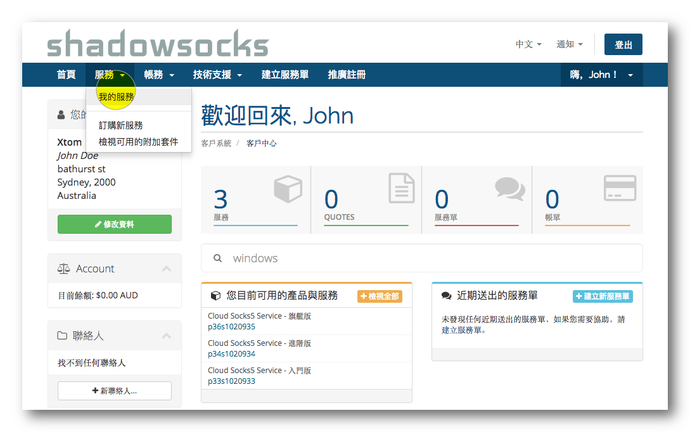  

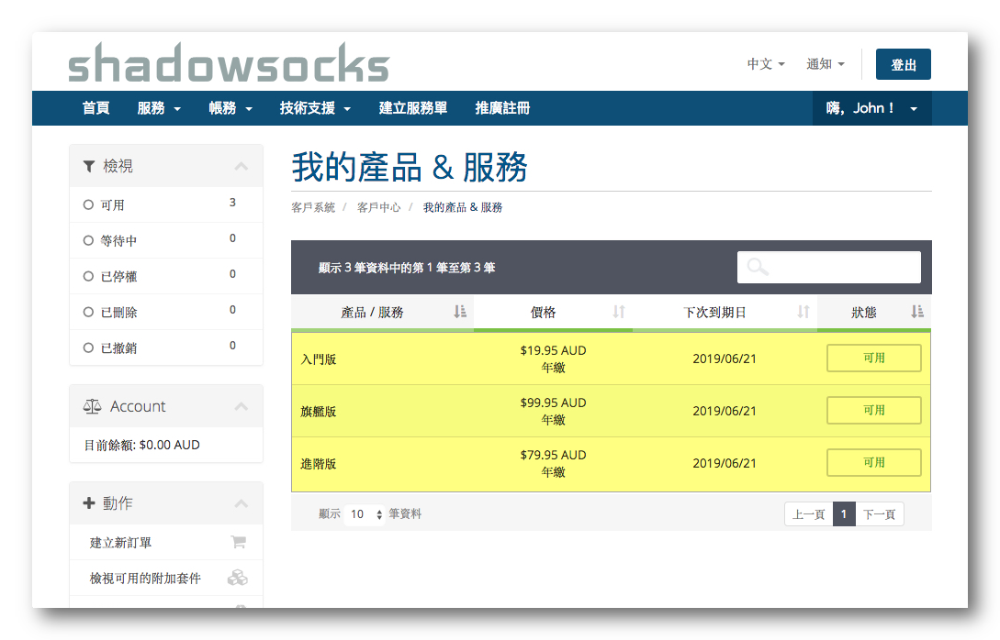  

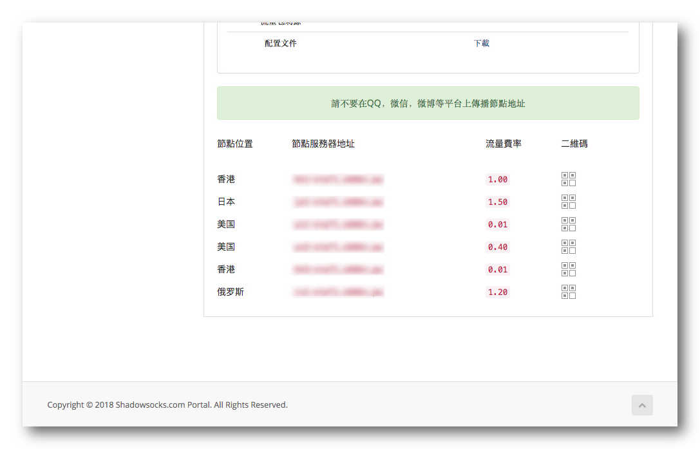  

## 下載配置文件

#### 登陸 [客戶中心](https://portal.shadowsocks.to) ,執行下列操作：

- 單擊 “服務” > "我的服務" 。

- 選擇 你可用的產品/服務 > "配置文件" > "下載" > "下載 Shadowsocks Windows 版本配置文件"。

- 即可下載到一個 `gui-config.json` 的文件。

  

  

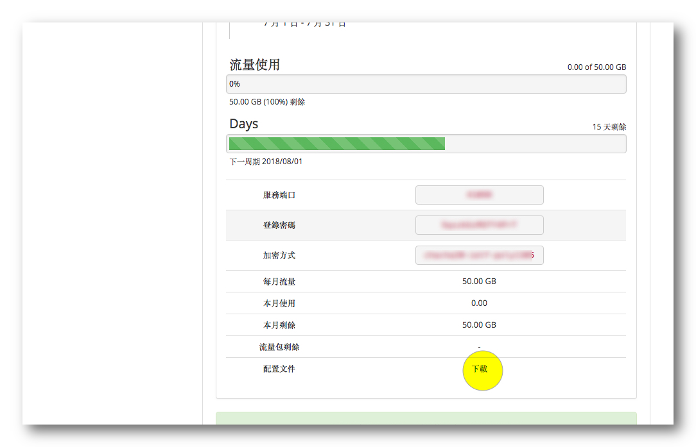

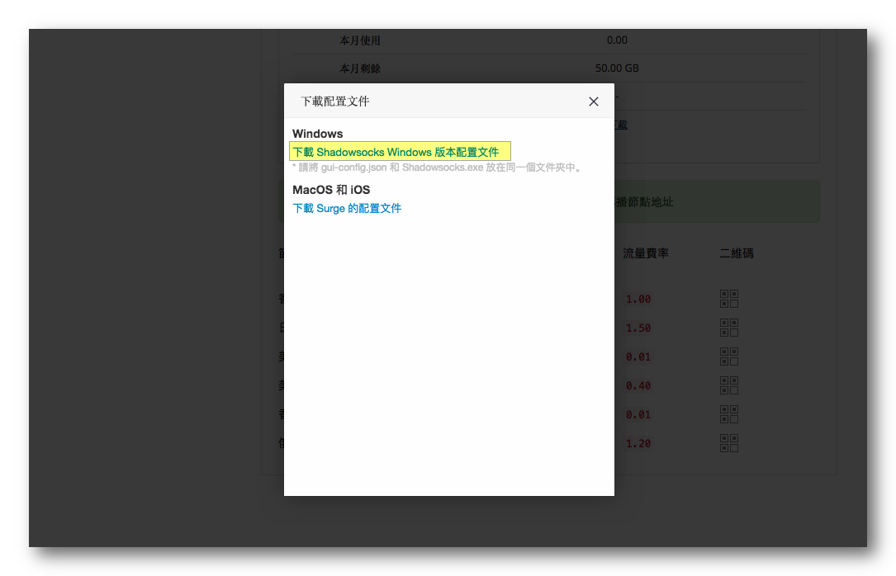

## 查看節點二維碼

#### 登陸 [客戶中心](https://portal.shadowsocks.to) ,執行下列操作：

- 單擊 “服務” > "我的服務" > 選擇 "你可用的產品/服務"。
- 查看你的節點信息 > 點擊 ”二維碼“ 圖標，顯示二維碼。

  

  

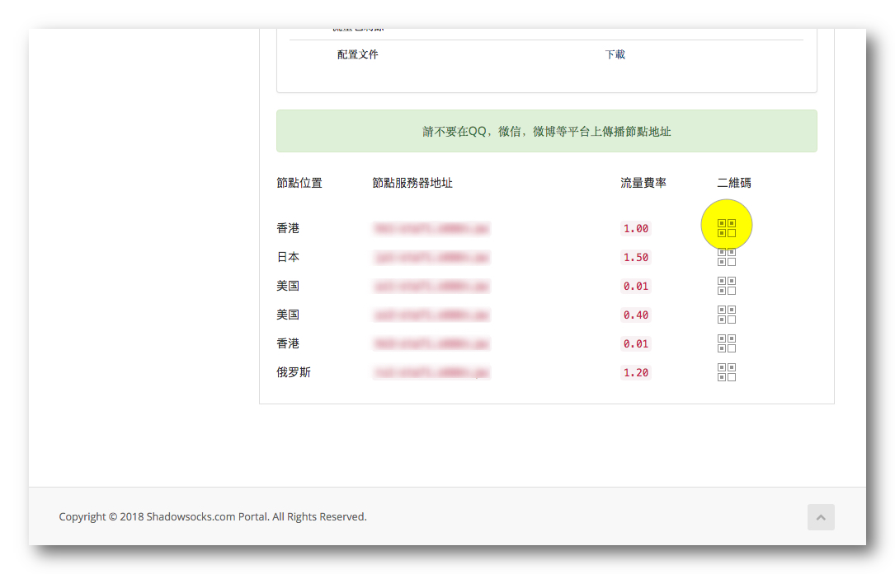
