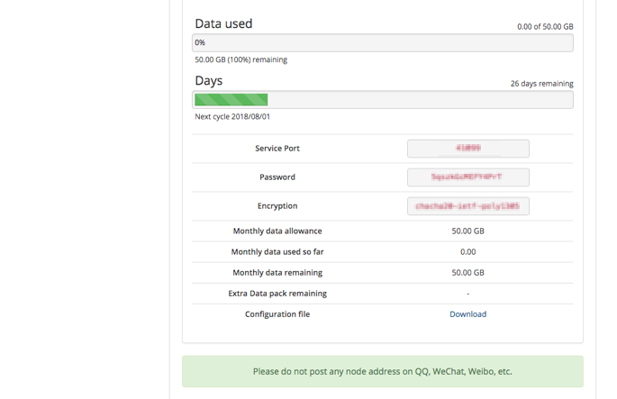

# Shadowsocks Setup Guide for MacOS

## About Shadowsocks
>* Shadowsocks is an open-source encrypted proxy project, Typically, the client software will open a socks5 proxy on the machine it is run, which internet traffic can then be directed towards, similarly to an SSH tunnel.
>* Shadowsocks uses a self-designed protocol for secure communications. The encryption algorithms include AES, Blowfish, IDEA, and RC4. No handshaking is needed except for creating a TCP connection. Each request only forwards one connection and does not need to maintain the state of “always connected”, so it is relatively power-efficient on mobile devices. All traffic is algorithmically encrypted, allowing you to choose your own algorithm.
>* Clients are available on multiple major operating systems and platforms, including Windows, OSX, Android, Linux, and iOS systems and routers (OpenWrt).

## System Requirements
**Before you install, always make sure that your system meets the minimum system requirements.**

You need MacOS 10.11  or later to run Shadowsocks. If your operating system is older, upgrade to MacOS 10.11 or later.

## Installing Shadowsocks
Follow the instructions below to download and install ShadowsocksX-NG on MacOS.

### 1. Download the client

Go to Shadowsocks [download page](https://github.com/shadowsocks/ShadowsocksX-NG/releases/).
Click on the latest version of `ShadowsocksX-NG.x.x.x.zip` to download (`x.x.x` is the version number).

Or download form [Client Portal](https://portal.shadowsocks.to/index.php?rp=/download/category/1/Shadowsocks-.html)

### 2. Install the client

Double-click on "ShadowsocksX-NG.x.x.x.zip" to extract "ShadowsocksX-NG".

Move "ShadowsocksX-NG" to "Applications".

Double-click "ShadowsocksX-NG" in "Applications" > select "Open".

## Configure Shadowsocks Account

### Log in to our website (https://portal.shadowsocks.to) and do the following:

* Click Services > My Services > Select your available products & services

* View your node information.

### On your computer, do the following:

* Click on the "ShadowsocksX-NG icon" > "Servers"> "Server preference" in the menu bar at the top of the screen.

* Click "+" on the window > fill in "Address" (for your Node addresses) > fill in "Service Port" after ":" > select "Encryption".

* Fill in the "Password"  > Fill in the "Remarks" as optional (it is recommended to fill in the
 Node locations).

* Click "Turn Shadowsocks on".

### You can also add nodes individually by QR code. On your computer, do the following:

This QR code also applies to other clients.

* Click on the "ShadowsocksX-NG icon" > "Scan QR Code From Screen"> When you see "Add shadowsocks server Profile By scan QR Code", it means that the shadowsocks was added successfully.

* Click "Turn Shadowsocks on".

## Configure System Proxy Mode
* Click on the "ShadowsocksX-NG icon"" > "PAC Auto Configure Mode" in the menu bar at the top of the screen.

## Attention
* **Global mode** means that most of the traffic in the computer will go through a proxy, and it is not recommended for daily use, because it will easily let the torrent downloads through our proxy, and causing a **serious consequence** by receiving ISP complaints.

* It is recommended to use **PAC** mode, which allows automatic proxy and access to non-blocked websites without proxying.
